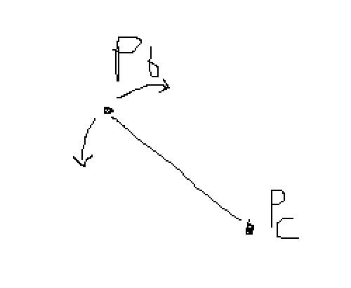
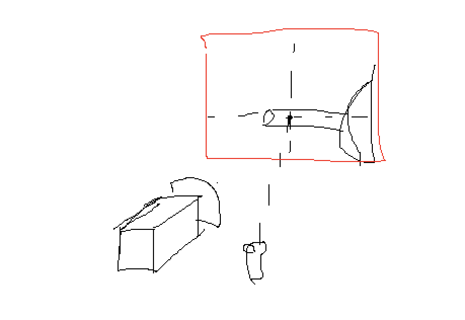
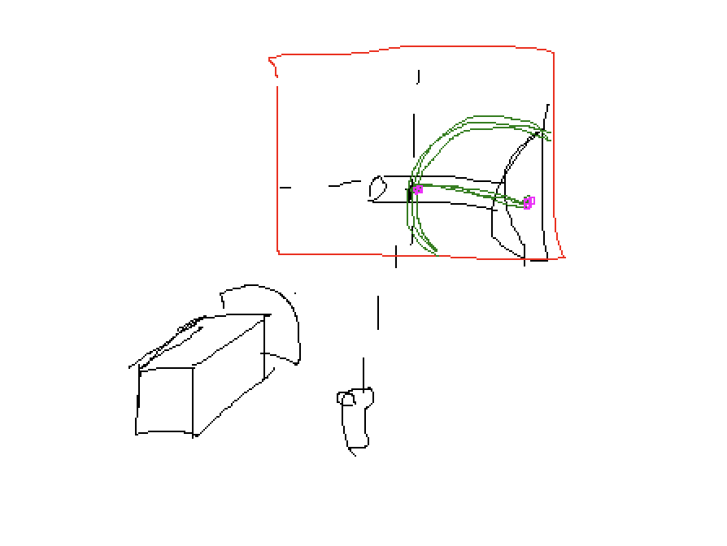
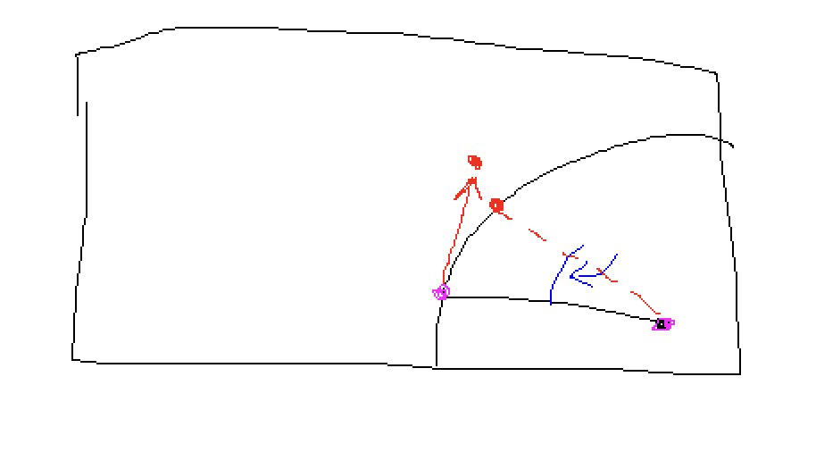

# SubmarineNavigatorVR
Une expérience VR immersive qui simule une simple navigation sous-marine, dans laquelle les utilisateurs interagissent avec des commandes telles que des leviers et des vannes à l'aide de contrôleurs VR.

## Le Sonar

## Les Collisions

Les collisions déclenchent les scripts et les effets suivants : 
- Particules (étincelles)
- ControllerShake.cs
- ScreenShake.cs
- Lumière d'alarme clignotante

## Instructions pour les contrôles de la manivelle et du levier

## Contrôles de la Manivelle (Il faut (dé)commenter le bloc de code correspondant)
### Utilisation avec la manette VR :

1. **Sélectionnez la manivelle** avec votre **main gauche**.
2. Utilisez les boutons suivants de la manette VR :
   - **Bouton X** : Tourner dans le sens **anti-horaire**.
   - **Bouton Y** : Tourner dans le sens **horaire**.

### Utilisation avec le clavier (Numpad) :

1. **Sélectionnez la manivelle** (simulé dans Unity avec le XR Device Simulator (ou cochez le debug)).
2. Utilisez les touches du pavé numérique :
   - **Touche Numpad 4** : Tourner dans le sens **anti-horaire**.
   - **Touche Numpad 6** : Tourner dans le sens **horaire**.

(Note, le modèle de la manivelle se bloque quand il a atteint sa rotation maximale pour indiquer au joueur son état)
---

## Contrôles du Levier
### Utilisation avec la manette VR (Il faut (dé)commenter le bloc de code correspondant):

1. **Sélectionnez le levier** avec votre **main droite**.
2. Utilisez les boutons suivants pour contrôler le levier :
   - **Bouton A** : Abaisser le levier (vers le minimum).
   - **Bouton B** : Lever le levier (vers le maximum).
   - **Boutons A + B ensemble** : Retourner le levier à la position neutre.

### Utilisation avec le clavier :

1. **Sélectionnez le levier** (simulé dans Unity avec le XR Device Simulator (ou cochez le debug)).
2. Utilisez les touches du pavé numérique :
   - **Touche Numpad 8** : Avancer le levier.
   - **Touche Numpad 2** : Reculer le levier.
   - **Touche Numpad 5** : Retourner le levier à la position neutre.

---

## Scripts de Test
Les scripts de test sont regroupés dans le dossier `Ancien Scripts & Tests` et deux sont dans les scripts:
- **`LeverMovementClick.cs`**
- **`LeverVR.cs`**

### Notes sur les tests :
- D'autres tests ont été réalisés pour tenter de faire fonctionner une méthode utilisant **LookAt()**, mais ces solutions n'ont pas été conservées dans les versions finales.
- **HingeJoint** a également été testé. Ce dernier donnait des résultats prometteurs, mais il était difficile à tester sans casque :
  - Le levier était correctement restreint sur l'axe et respectait les limites d'angles.
  - Cependant, lorsqu'il était attrapé :
    1. Le mouvement de la main dans le simulateur ne permettait pas de confirmer si le levier suivait bien.
    2. Le levier retournait à l'origine du rayon de la manette tout en suivant les restrictions définies.

---

## Problématique du Levier

#### Étapes :

1. **Récupérer le select** (booléen OnSelect) avec le grabInteractable.
2. **Restreindre le déplacement** du levier sur un axe avec un angle minimum et maximum.
3. **Orienter le levier vers la main** à l'aide de la fonction `LookAt()`.
4. **Contraindre la position de la main virtuelle** :
   - Projeter la position de la main sur un plan aligné avec l'axe du levier à l'aide de la fonction `ProjectOnPlane()`.
5. **Changer de référentiel** :
   - Passer la position de la main dans le référentiel du levier (`lever.transformPosition(Main)`).
   - Remettre certaines coordonnées à zéro.
   - Appliquer une transformation inverse pour retourner dans le référentiel global.

## (Autre idée de solution)
### - Levier : 2 points

- Le point de rotation **Pc**
- Le bout du levier **Pb**
- **Pb** tourne autour de **Pc**

### - Plan du levier / axe de rotation

- Un plan abstrait parallèle à l'axe de rotation, passant par le point de contact du levier, touché par le raycast.
- Le controller détecte une collision, activant un booléen `inside` à `true` (ou `false` sinon).

### - Transposition du problème en 2D

- Le point **Pc** est projeté sur ce plan.
- Un demi-cercle (ou une portion limitée) est imaginé en 2D sur ce plan, avec pour centre le projeté de **Pc** et le point de collision du controller.

### - Point de la manette sur le cercle

- À chaque frame, le projeté du point la manette sur le plan est calculé, ce qui donne un nouveau point.
- Ce point est projeté sur le cercle, fournissant un angle de rotation.
- On applique une transformation inverse pour ramener cet angle dans le repère du levier, obtenant un angle "local".
- **Pb** prend la position du point projeté.

---

## Les possibles améliorations/idées :
1. **Coupler les inputs VR grabs et Trigger.**
2. **Valve** : Ajouter une "ligne de comptage" pour compter chaque tour complet lorsqu'un collider passe par la ligne et réinitialiser la rotation.
3. **Améliorer l'effet de l'eau** en ajoutant un cube qui monte sous le sous-marin, avec une texture "eau" sur le cube (plus simple et possiblement meilleur rendu).
4. **Indicateur visuel** : Créer un sprite plus petit ou un point avec un cône/flèche pour indiquer la direction du sous-marin.
5. **Vitesse linéaire** : Remplacer la vitesse angulaire par une vitesse linéaire.

## HingeJoint / Semi-tuto (Vidéo disponible sur le GitHub)

Le levier utilise un **LeverAttach** (enfant) :
- **LeverAttach** est une sphère de la taille du sommet du levier, avec un collider agrandi pour permettre l’interaction.

Le levier principal comporte :
1. **RigidBody** (sans gravité).
2. **Capsule Collider**.
3. **XR Grab Interactable** :
   - Ajouter les colliders du **LeverAttach** dans la liste des colliders.
   - **Movement Type** : "Velocity Tracking".

Enfin, un composant **HingeJoint** sur le levier avec les paramètres suivants :
- **Anchor** : Positionnée à la base du levier.
- **Axis** : X:0 Y:0 Z:1 (pour pivoter autour de l'axe Z).
- **Use Spring** : Activé avec un damper à 2 (optionnel).
- **Use Limits** : Activé avec une plage d'angles de -45° à 45°.

## SubmarineNavigator : Gestion des collisions et déplacement du sous-marin

Le script SubmarineNavigator gère la simulation de navigation sous-marine en VR. Il effectue les tâches suivantes :

1. Détection des collisions

Le sous-marin navigue dans un espace défini par une texture 2D (mapTexture) représentant les murs (pixels noirs) et les passages (pixels blancs). La fonction IsCollidingWithWall() permet de détecter si la position actuelle du sous-marin entre en collision avec un mur.

Étapes :

- Conversion de la position virtuelle en coordonnées de texture.
- Vérification si les coordonnées tombent sur un pixel noir.
- Si oui, cela déclenche une collision : Un message d’avertissement est logué, le sous-marin inverse sa direction et son angle est ajusté pour éviter les collisions continues.

2. Gestion de la trajectoire et vitesse

Le sous-marin se déplace sur une trajectoire circulaire définie par un centre (centerPoint), un rayon (radius), et un angle dynamique :

- L'angle est mis à jour selon la vitesse actuelle.
- La position virtuelle est recalculée via CalculateVirtualPosition() en fonction de cet angle.

Le rayon est ajusté via la méthode UpdateRadius(), en prenant en compte la rotation d'une manivelle (simulée ou via contrôleurs VR).
